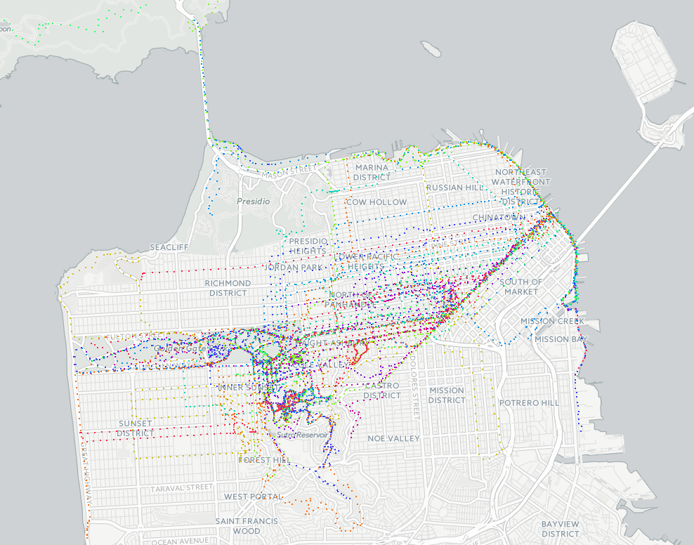

# Heatflask

Heatflask animates your [Strava](https://www.strava.com) activities on a map, at [heatflask.com](https://www.heatflask.com).

## Running it locally

The development environment is a [Nix](https://nixos.org) flake, which provides Python, MongoDB and Node. On Linux, in the root of the repo:

  1. `nix develop`, then `heatflask-setup` to install both sets of dependencies and the git hooks.
  2. Copy [`backend/.env.example`](./backend/.env.example) to `backend/.env` and put your Strava app's client id and secret in it; see [`backend/README.md`](./backend/README.md).
  3. `heatflask-start-services` to start MongoDB, `heatflask-frontend-watch` to build the frontend and rebuild it as you edit, and `heatflask-run` in a second shell for the server.

The server runs at http://127.0.0.1:8000.

For more, see [#Contributing](#contributing).

## Contributing
See [`/contributing.md`](/contributing.md).

## Support
Heatflask is free, and built and run by one person. If it's worth something to you, you can [sponsor it on GitHub](https://github.com/sponsors/ebrensi).

## License

Heatflask is free software, licensed under the GNU Affero General Public
License, version 3 or later [(AGPL-3.0-or-later)](https://www.gnu.org/licenses/agpl-3.0.html).
The full text is in [`/LICENSE`](/LICENSE).

You are free to use, study, modify and share this code, including
commercially. What the AGPL asks in return is reciprocity: if you distribute a
modified version, **or run one as a network service**, the people using it must
be able to get your version's complete source under this same license. That
network clause (section 13) is the point — it is what keeps a modified
Heatflask from being run as a closed service.

Previous releases were licensed under the GPLv3, and anyone who received them
under those terms keeps them.

A few files are adapted from other projects under permissive licenses; see
[`/THIRD-PARTY.md`](/THIRD-PARTY.md).

### Commercial licensing

If the AGPL doesn't work for you — for example, you want to build Heatflask's
code into a product without releasing your own source — I am open to licensing
it to you under different terms. [Get in touch](mailto:info@heatflask.com).

I would also appreciate being credited if Heatflask's ideas turn up in your
work, even where nothing legally requires it.

Copyright (c) 2016-2026 [Efrem Rensi](mailto:info@heatflask.com)

Feel free to [contact me](mailto:info@heatflask.com) with questions or suggestions

